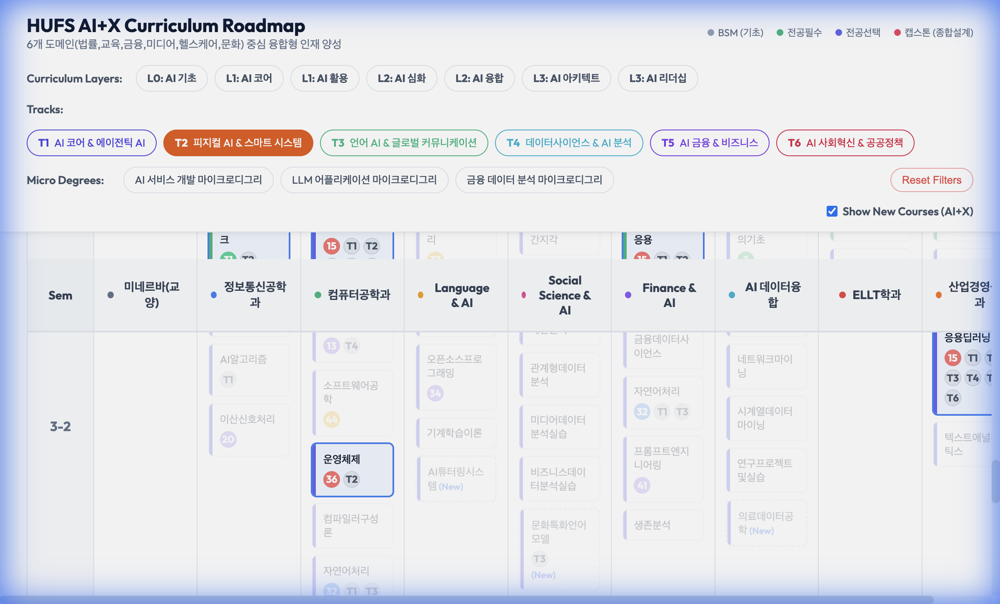
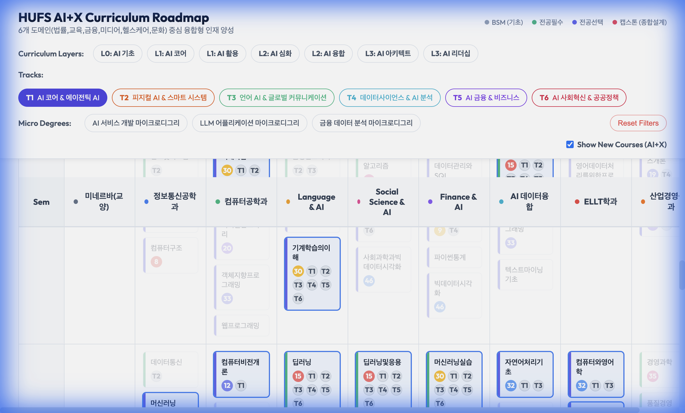
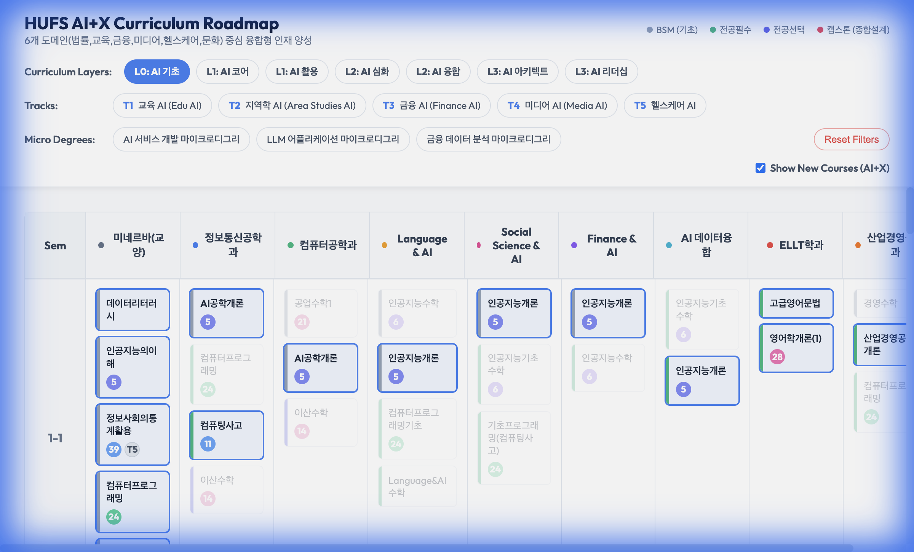

# AI + X Curriculum Roadmap - Layer System Update

This document outlines the implementation of the **AI Full-Stack Layer System** (L0-L3) and the **6 Major Tracks System (v3)**.

## 1. Feature Overview

We have re-indexed the Layer System from **L1-L4** to **L0-L3** within a foundation layer (L0).
We also implemented a **6 Major Tracks** design to cover the full spectrum of AI convergence.

### New Layer Definitions
*   **L0**: AI 기초 (AI Basics) - *Common Foundation* (Minerva & Intro Courses)
*   **L1**: AI 코어 (Core) vs AI 활용 (Application) - *Major vs Non-Major Tracks*
*   **L2**: AI 심화 (Advanced) vs AI 융합 (Convergence)
*   **L3**: AI 아키텍트 (Architect) vs AI 리더십 (Leadership)

## 2. 6 Major Tracks (v3 Design)

The roadmap features 6 distinct tracks, each with a unique color identity:

*   **T1: AI Core & Agentic AI** (Indigo) - *Algorithms & Agents*
*   **T2: Physical AI & Smart Systems** (Orange) - *Robotics & IoT*
*   **T3: Language AI & Global Communication** (Emerald) - *NLP & Speech*
*   **T4: Data Science & AI Analytics** (Cyan) - *Data & Decision Support*
*   **T5: AI Finance & Business** (Violet) - *Fintech & ESG*
*   **T6: AI Social Innovation & Public Policy** (Rose) - *Ethics & Governance*

## 3. Verification

### T2 Physical AI & Systems (Orange)
Expanded to include **OS**, **Network**, **Comms** alongside Robotics.

### Common Core Verification (T1 Indigo)
Deep Learning/ML are common across tracks. Here shown in T1.

### L0 Highlight (AI Basics)
Highlights **Minerva** courses (Data Literacy, AI Understanding, etc.).

